<div align="center">


</div>

<div align="center">

```
███╗   ██╗ █████╗ ██████╗  ██████╗ ██╗     ███████╗ ██████╗ ███╗   ██╗███╗   ██╗███╗   ██╗
████╗  ██║██╔══██╗██╔══██╗██╔═══██╗██║     ██╔════╝██╔═══██╗████╗  ██║████╗  ██║████╗  ██║
██╔██╗ ██║███████║██████╔╝██║   ██║██║     █████╗  ██║   ██║██╔██╗ ██║██╔██╗ ██║██╔██╗ ██║
██║╚██╗██║██╔══██║██╔═══╝ ██║   ██║██║     ██╔══╝  ██║   ██║██║╚██╗██║██║╚██╗██║██║╚██╗██║
██║ ╚████║██║  ██║██║     ╚██████╔╝███████╗███████╗╚██████╔╝██║ ╚████║██║ ╚████║██║ ╚████║
╚═╝  ╚═══╝╚═╝  ╚═╝╚═╝      ╚═════╝ ╚══════╝╚══════╝ ╚═════╝ ╚═╝  ╚═══╝╚═╝  ╚═══╝╚═╝  ╚═══╝
```


<br/>


&nbsp;

&nbsp;


</div>

---


### About Me
```yaml
name: Akbar Permana
alias: Napoleonnnnn
location: Indonesia

role: AI/ML Engineer
focus:
  - AI & Machine Learning
  - Intelligent Automation

philosophy: >
  "First, solve the problem.
   Then, write the code."


```

<br clear="right"/>

---

## Tech Stack

<div align="center">

**Languages**


**Frameworks & Libraries**


**Tools & Platforms**


</div>

---

## Featured Projects

<div align="center">

</div>

<br/>

<table width="100%">
<tr>
<td width="50%" valign="top">

**Smart Kecapi Auto-Tuner**

Intelligent tuning system for traditional Sundanese instruments using real-time pitch detection and ML correction models. Built for Innovillage.

`Python` `TensorFlow` `DSP` `IoT`

</td>
<td width="50%" valign="top">

**Grading AI Agent**

Automated grading pipeline for Google Classroom — reads submissions, evaluates answers with LLM reasoning, and returns structured feedback.

`Python` `FastAPI` `Google API` `LLM`

</td>
</tr>
<tr>
<td width="50%" valign="top">

**IndoBERT Sentiment Scraper**

Real-time web scraper with sentiment classification using fine-tuned IndoBERT. Designed for social media monitoring at scale.

`Python` `HuggingFace` `BeautifulSoup` `NLP`

</td>
<td width="50%" valign="top">

**Dorm Room Automation Bot**

Smart home controller for IoT-enabled dorm rooms — voice commands, scheduled automation, and mobile dashboard integration.

`Node.js` `MQTT` `Raspberry Pi` `React`

</td>
</tr>
</table>

---

## GitHub Stats

<div align="center">


<br/><br/>


<br/><br/>


</div>

---

## Achievements

<div align="center">

[](https://github.com/ryo-ma/github-profile-trophy)

</div>

---

## Metrics

<div align="center">


<br/>



</div>

---

## Connect

<div align="center">


<br/><br/>

[](https://www.linkedin.com/in/akbarpermana/)
[](https://twitter.com)
[](mailto:your.email@example.com)
[](https://napoleonnnnn.dev)

</div>
---

<div align="center">


</div>


